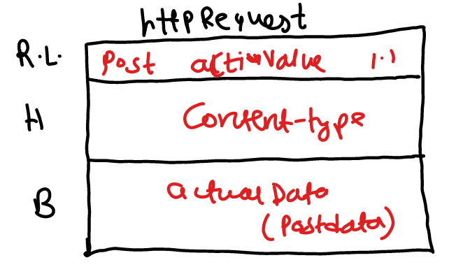
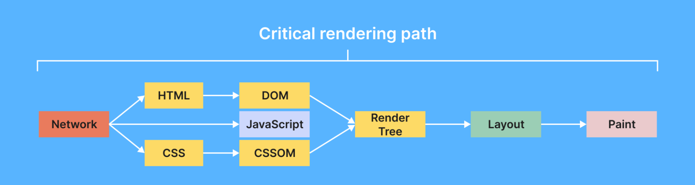
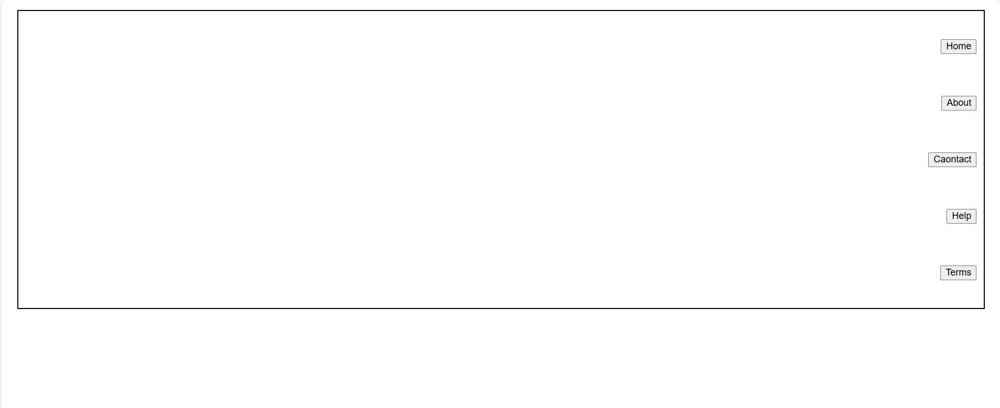
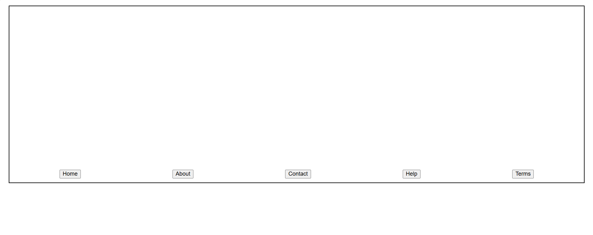
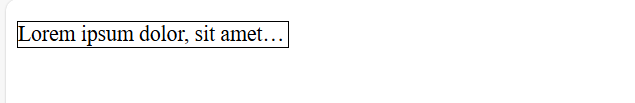

# Client Server Architecture

1. Client is a computer which is capable of sending request to other computers present in interenet.
2. We say client as a computer but in reality browser software is termed as a client.

# Server

1. It is a computer which has a capability to provide output to any number of clients.
2. Normally a server computer would be referred as high configuration computer.
3. Inside the server computer we install a server software called "web-server" (Ex's., Tomcat, glassfish, wildfly, Jboss)

Installing nodejs will promote a build tool through which we can automate the process of taking third party libraries from different websites to our project with the help of a command called "npm"

Q. What is a website, internet, web?

# HTML Parsing

On a browser to display the content. Our requirement we need to markup our content.

To markup the content on a browser, we need language called HTML.

# Evolution of HTML

1. GML - It stnads for Generic Markup Langauge
2. SGML - It stands for Standard Generic Markup Langauge, it is add on to the GML.
3. Tim Berner Lee introduced a new markup language called as HTML which is a subset of SGML.
4. Initially HTML was a open-source langauge.
5. HTML was introduced as a communicating langauge to web by Tim Berner Lee.
6. HTML is maintained by a community called "WhatWG"
7. HTML-4 version didn't gave importance for SEO and responsive design.
8. In HTML-5 different <u>semantics</u>(elements) to give importance for SEO and resposive designs.

- NOTE: SEO refers to Search Engine Optimisation

8. Whenever we type some content on a browser which needs to be searched on google search engine uses SEO technique(Robos like bot, web crawlers, web spider,... etc)

### Categories of HTML elements

1. Normal Elements - `<b>`
2. Void Elements - ``
3. RC(Rich Context) Data Elements

Ex.:

```
    <textarea>
        <p>Hello pw'ian</p>
    </textarea>
```

Ouptut:
<!--  -->

4. Raw Text Element

Ex.:

```
Temperature25C 4500/-
```

```
Temperature25&deg;C &#8377;4500/-
```

<!--  -->

5. Foreign Elements - ex. svg, mathml

## Structure of HTML

Arranging the elements of HTML in a hierarchial way to a present on a webpage is called "DOM"(Document Object Model).

Skeletal Structre:

```
<html>
    <!-- Document scope -->
    <head>
    </head>

    <body>
    </body>
</html>
```

The content presented in head section is mainly used for SEO and responsive design.

The elements which can be written inside `<head>` section are:

1. `<title>`
2. `<link>`
3. `<meta>`
4. `<style>`
5. `<script>`

- `<!DOCTYPE html>` - It is indication to browser engine that in the body section we use elements of html-5.
- `<html lang = "en-IN">` - It is indication to browser engine that the output should be feasible to the end-user in a particular format.

## Body Section(Dynamic content)

- Attributes of body tag:

1. bgcolor - this attribute is used to set the background color for the body section
2. text - this attribute is used to set a different color valuefor the content to be presented on a webpage.

Ex.: `<body bgcolor = "black" text = "white"> </body>`

- To control the elements of a webpage after the presentation we go for CSS(Styling language)

CSS attributes for background:

1. background-repeat : repeat| non-repeat| repeat-x| repeat-y
2. background-size : contain| cover| auto |width&height in pixels
3. background-position : top| center| right| left
4. background-attachment : fixed | scroll

### HTML5 new semantics(Elements)

1. Header
2. Section
3. Nav
4. Main(Entry point)
5. Article
6. Figure
7. FigCaption
8. Dialog
9. Aside
10. Footer
11. Div
12. Span

## Div v/s Span

The `<span>` tag is myuch like the `<div>` element, but `<div>` is a bloack-level element and `<span>` is an inline element.

Padding is used to create space around an element's content, Inside

1. To align the content in column wise in css we use have an option called `display: flex;`
2. We can control the attributes of font through css using

   - `font-family:`, `font-style:`, `font-size:`, `font-weight:`,

3. For a span element width property can't be applied directly (no effect). To see the effect we use attribute called `display: inline-block;`

- Default screen width is 1200px, so max no. of columns in a page is 12.

### Different Types of css selector

1. Selecting child and sibling in css

   :

   parent child { ==> Child Selector

   }

   ElementA + ElementB { => Adjacent Building

   }

   ElementA ~ ElementB { => All elements after specific

   }

- For any image to be blurred and if the content has to be presented on a blurred image we go for an attribute called `background-color: rgba();`, "a" stands for alpha and range of alpha is 0 to 1.
- To display any content to the center (Horizontal and Vertical):

  1. Keep all the the content in one contaier
  2.

  ```
  <body>
      <div>
          // Your content here
      </div>
  </body>
  ```

  3. Body is the container here which would display the contents center with attributes

  ```
  body {
      display: flex;
      justify-content: center;
      align-items: center;
      height: 100vh;
  }
  ```

  Note:

  - justify-content

- Figcaption element is used by searche engine to load the image as a search result for the end user.

```
<figure>
    <div>
        <!-- PLACE IMAGE -->
    </div>

    <figcaption>
        Browser Image
    </figcaption>
</figure>
```

- Element designed for coding platforms

  1. `<code></code>` - To indicate the presentation content is for programming
  2. `<var></var>` - To indicate the browser engine that it is a variable
  3. `<samp></samp>` - To indicate the description about program we use `</samp>` element.

- What is difference b/w `<br>` and `<br/>`?

1. There is not such element called "`<br>`" in HTML.

- `<pre>` - It is used to preserve the whitespaces in particular container

- `&nbsp;` - It is used to mark the spaces set by the user for any element

#### Small Text and Big Text

- `<small>content</small>` :: It sets letter size smaller
- `<big>content</big>` :: It sets letter size large

#### Details and summary

Syntax:

```
<details>
    <summary>content</summary>
</details>
```

#### Details and summary

- It is used to display the content in detail only when required.
- It allows to expand and collapse your content.
- It saves the screen space

## Data List with Terms and definitions:

```
<dl>
    <dt>Term</dt>
    <dd>Definition</dd>
    <dt>Term</dt>
    <dd>Definition</dd>
    <dd>Definition</dD>
</dl>
```

Note:

- `<dt>` and `<dd>` will have some default alignment, so it is easy for presentation.
- `<dl>` has the capability to display in columns using grid (`<dt>` -> one column an `<dd>` -> one column)

Note:

```
dt {
     position: sticky;
     top: 0;
}
```

NOte:
In Css we can set shadow to any container by using box-shadow attribute.

- Box shadow will have 4 values

```
{
    box-shadow: horizontal vertical blur color;
}
```

## Heading elements in HTML

- Heading elements are mainly used to define headings and to describe a <u>topic</u> in a webpage
- Heading element default behaviour is:

  1. Display -> block
  2. font-weight -> Bold
  3. font-size -> vary according to hn : 1 to 6 -> the size will decrease

Q. 3 Can we change the apperance of `<hn>` tags?

Ans :

> Through css we can change the default behaviour.

```
h1 {
    font-size: 50px;
    font-weight: lighter;
    color: blue;
}
```

Q. 4 Can we remove the default style defined for heading?

Ans:

> Yes it can be made possible with the help of css Inheritence.

```
h1 {
    text-align: center;
    display: unset;
    font-size: unset;
    font-weight: unset;
}

h2 {
    all: unset;
}
```

## Working with paragraphs
1. `<p></p>` - To present the content in the form of paragraph we use `<p>` element.
- It supports "align" attribute, which can set text left, center, right or justified.
- paragraphs will have a line break before and after.

2. `<blockquote></blockquote> ` - It is used to present summary of content in. By default the behaviour would have left right indentation and some margin bvalue for blockquote.

Q. How to set the first-line indent for paragraph or blockquote?
using css attribute `text-indent: __px`

Q. how to set line space, word space, character space in a paragraph

Using CSS attributes `line-height:, word-spacing:, letter-spacing:`.

Ex.:

```
blockquote {
    text-indent: 50px;
    line-height: 30px;
    word-spacing: 7px;
    letter-spacing: 3px;
}
```

Q. How to set dropcap?

- By using the following style we can set dropcap:
    - Access the first letter using the class : first-letter
    - After accessing the firstletter apply fonts[size, weight, family]
    - Apply css float


- Difference between display: grid; vs column: ; of a css attribute

    1. display: grid; would display the content column wise in the given frame width(column ratio).
    2. columns:; this attribute take number of columns as the input and display the content in continuous

## Text Formatting In HTML
- We can change the text formatting using font
font: we can change the face (family), size and color.

face - font family

color - It represents color name and color code

size - 1 to 7 (increasing order)
```
<font face = " " size = "" color = ""> Your Text </font>  
````

- HTML attribute for style


    |Tag|Design Team| Review Team|Output|
    |----|------|-------|-------|
    |Bold|`<b>` |`<strong>`|<b>Bold</b>|
    |Italic|`<i>`|`<em>`|<i>Italic</i>|
    |Underline|`<u>`|`<ins>`|<u>Underline</u>|
    |To strike down|`<strike>`|`<del>`| <del>Strike</del>|

- What are web safe fonts:

> These fonts are such fonts which would be available in every machine and it can't be deleted .


Ex: sans-serif, mono space, serriff

     
## Ordered And undorderd List

- Order list will add auto numbering for a list of option, which can update automatically when your add or delete items.
- Orders list is defined by using `<ol>` element
- Itemns in list are defined by using `<il>`

Syntax:

```
<ol>
    <li>Itme-1</li>
    <li>Itme-2</li>
<ol>
```

Note : Default numbering will be given for items

`type` : It specified the numbering type, which can be: a, A, i, I, 1(default)

start[number] - It defines the numbering level to start with.

## Nesting in list elements


Bad Code
```
<ol>
    <li>Front End</li>
        <ol type = "a">
            <li>HTML</li>
            <li>CSS</li>
        </ol>

    <li>Back End</li>
        <ol type = "a">
            <li>Node JS</li>
            <li>MongoDB</li>
        </ol>
    
</ol>
```


Good Code
```
<ol>
    <li>Front End
        <ol type = "a">
            <li>HTML</li>
            <li>CSS</li>
        </ol>
    </li>

    <li>Back End
        <ol type = "a">
            <li>Node JS</li>
            <li>MongoDB</li>
        </ol>
    </li>

</ol>
```


Questions:
1. How to remove numbering in orderlist?

    Ans 
    > It is possible to remove numbering of ordered list element throught a css attribute called `list-style: none;`

2. How to create scrollable list?
    Ans
    > Keep a Border, Keep a proper width and height as per the content area. Using an css attribute `overflow: hidden | scroll | auto`.
    

3. How to display list items inline?
    
4. How to display li in columnss wise?


    i. 
```
ol {
    display : grid;
    grid-template-columns: 6fr 6fr;
}
``` 


```
ol {
    columns: 2;
}
```
5. How to change the options in ordered list?


## Unordered List
Syntax:

```
<ul type = "square">
    <li>Web Server</li>
    <li>Web Site</li>
    <li>Web Page</li>
</ul>
```

How to set up custom bullets?

Ans:  We can do by using `list-style-image:;` attribute of css.

## Pagination

-- It refers to the process of displaying the records by splitting them into <u>pages</u>.  

```
<ul>
    <li><span>&laquo;</span></li>
    <li><span>1</span></li>
    <li><span>2</span></li>
    <li><span>3</span></li>
    <li><span>4</span></li>
    <li><span>5</span></li>
    <li><span>....</span></li>
    <li><span&raquo;</span></li>
</ul>
```

We can use only those images from google which are filtered using : Creative common licenses. So that our website we don't get copyright.

from -> tools


> Different types of images:

|Sr Number| Abbreviation| FileFormat| MIMEType| FileExtension|
|---------|-------------|-----------|--------|--------------|
|1.|APNG | Animated Portable Network Graphics| image/png| .apng|
|2. |BMP| Bitmap File| image/bmp| .bmp|
|3. |GIF| Graphics Interchange Formage| image/gif| .gif|
|4. | ICO| Microsoft Icon| image/x-icon| .ico, .cur|
|5. | JPEG| Joint Phototgraphic Expert Group| image/jpeg| .jpg. jpeg, .jtif, .pjpeg, .pjp|
|6. | PNG| Portable Network Graphics| image/png| .png|
|7. |SVG| Scalar Vector Graphics| image/svg+xml| .svg|
|8. |TIFF| Tagged Image File Format|image/tiff|.tiff, .tif|
|9. | WEBP| Web Picture Format| image/webp|.webp|


Q. What is MIME Type ?

- MIME stands for "Multipurpose Internet Mail Extension"

- Server upon sending the information to the browser, it will also send what type of information is being send.

- To inform the type of information we go for MIME Type.

Purpose of different types of images:

|Type| Purpose|
|--|--| 
|PNG| High resolution(More space), Suitable for downloads|
|JPG| Compressed Image Format(Less Space) , Good for on screen presentation|
|GIF| Low Resolution, used for animations|
|SVG| Ex. : 1. Google Map, 2. Bootstrap Icons,  not pixel based, high zoom quality|
|WEBP|If we try to save an image it saves the entire page. Image alone can't be captured |

Embedding an image in webpage:

- It is a void element
- `` is configure with following attributes
``

Ex 1:

```
<figure>
        
        <figcaption>IPHONE</figcaption>
    </figure>
```

Card 

Standard Card Templated - 

<div style = "border: 1px solid white">
<h2 align="center" style = "border: 1px solid white">Card Header</h2>

<div style = "display:flex; justify-content:center; border: 1px solid white;" >
    Card Body
</div>

<div style = "border: 1px solid white;">
Card Footer
</div>
</div>


<hr>


### What are fluid images?
- If we set the width and height of an image in percentage then the image will be adjusted to the browser window. If the image is adjusted to browser window through percentage then such images are termed as fluid images 

## Links in HTML
- Links are basically used to navigate from one page to another page.
- Links normally will be clickable text or image which gets navigated through a protocol called "http".

### Syntax:-
```
<a href="">HOME</a>
<a href="">Men Fashion</a>
<a href="">Kids Fashion</a>
<a href="">Women Fashion</a>
```
- We can create links in two ways-
  1. Intra document links
  2. Inter document links

### Intra document links :-
- It refers to navigating from one location to another location <u>within the same page.</u>

#### Que.) How to remove undrline from link element ?
=> Using CSS attribute called `text-decoration: None;`

#### Que.) How to change link color ?
=>> Using CSS attribute 
``` 
a:link{
color: #0x0x0x";
}
```

#### Que.) In case of image attribute to specify the path we use "src", In case of link attribute to specify the path we use "href" WHY ?
=>> "src" -- It behaves like `'getter' for image` elements so we specify the path through "src" element.<br>
"href" -- It behaves like `'setter' for anchor` elements so we specify the path through "href" element.
> 127.0.0.1:5500/link-document-html#Home

#### Que.) What is the difference between "url" and "uri" ?
=>> "URL" -- stands for uniform resource locator.
> https://www.myntra.com/fasttrackwatches <br>

"URI" -- stands for uniform resource identifier. It is used for accessing a particular element in a website through some names.


#### Que.) How to create empty link in HTML ?
=>> To create an empty link we use a JavaScript code as shown below-
```
<a href="javascript:void()">Empty Link</a>
```
(testcase passed )<br> T
o give a link which would actually navigate we use the following code-
```
<a href="javascript:void(location.href='')">Empty Link</a>
```

Note:- <br>
=> Whenever we send a request, browser would create an object called `HttpRequestObject` the structure of HttprequestObject is given below- <br>

<!-- image to be pasted --> HTTP Request

Link Request is of "get method" type.

=>> If the request is of "get" type then there would be ` No request body.` 
( Data will be sent to the server through URL.)

=>> Server will send the responce by creating "Http Responce Object".

<!-- Image to be pasted --> HTTP Response

## Error Number and Messages:-

### 1XX Informational
|Number| Error Message|
|-------|-------------|
|100| Continue|
|101| Switching Products|
|102| Processing|
|103| Early Hints|

### 2xx Successful
|Number| Error Message|
|-------|-------------|
|200| OK|
|201| Created|
|202| Accepted|
|203| Non-Authoritative|
|204| No Content|
|205| Reset Content|
|206| Partial Content|
|207| Multi-Status|
|208| Already Reported|

### 3xx Redirection
|Number| Error Message|
|-------|-------------|
|300| Moved Permanently|
|301| Found|
|302| See Other|

### 4xx Client Error
|Number| Error Message|
|-------|-------------|
|400| Bad Request
|401| Unauthorized|
|402| Payment required|
|403| Forbidden|
|404| Not Found|
|405| Method Not Allowed|
|406| Not Acceptable|
|409| Conflict
|413| Payload Too Large|
|429| Too Many Request|

### 5xx Server Error
|Number| Error Message|
|-------|-------------|
|500| Internal Server Error|
|501| Not Implemented|
|502| Bad Gateway|
|503| Service Unavailable|
|504| Gateway Timeout|
|505| HTTP Version Not Supported|
|506| Variant Also Negotiates|
|507| Insufficient Storage|
|508| Loop Detected|
|510| Not Extended|
|511| Network Authinication Required


Note:- <br>
=>> Normally Links will be currupted by the end user through a technique called "URL Rewriting". 

### Inter Documentation Links:-
Que. How to display the content of a link in new tab? <br>
=> using CSS attribute called `target="_blank" `.

Que. How to specify upon clicking linking a file a document to be downloaded ? <br>
=> 
```
<a href="" download="">
```
The file will be downloaded with the link name. To download a file with user defined file anme, we use an option called `<a href="" download="File Name to be given">`.

`*Que.*` How to open a link document in new window ? <br>
=> 
```
<a href="javascript:window.print()">Printer</a>
```

## Table element in HTML :-
- Tables are use to organize the data in rows and columns(data presented inside a table is not SEO friendly).
- Tables internally are presented with the help og "grid component"
- Data in a table would be static whereas we give the effects of filtering, sorting through backend technologies.
- In earlier versions of HTML tables we used to design layouts(-rows and columns).
- In HTML 5 we use tables only to present data in static manner with the help of elements as shown below-

|Element| Description|
|-------|----------|
|`<table>` | It is a collection of rows and columns|
|`<caption>`| It sets caption for table which makes it SEO friendly|
|`<thead>`| It defines table header section|
|` <tbody>`| It defines table body section|
|`<tfoot>`| It define the table footer section|
|`<th>`| It defines column heading content[header cell]|
|`<tr>`| It defines table row|
|`<td>`| It defines table cell content[ordinary cell]|
|`<colgroup>`| It groups a set of columns to define effects|

### Attributes of table :-
1. `frame` : void, box, above, rhs, lhr, below

- void: It would not attach any border to the table.

This attribute is normally used to remove the outer border from the table.


2. `border` : This attribute is used to sset the border for entire table(for each cell and also it sets a frame for the entire table). The value of a border would be 0 or 1.

With respect to cell if we increase it to 4, 5.....any number they would not generate any effect.

3.`cellspacing` and `cellpadding` : It is similar to margin and padding of CSS.

4. `rules` : rows, columns, all, none.

> If we use rules and border together rules value would dominate.

Whenever we use rules we should not work with border and when we use border we should not use rules.

5. `backgroung` and `bgcolor` : 

- bgcolor : It sets background color for the table, body, header, footer, cell, row.
- backgroung : It sets background image for table, group, cell, row.

Syntax:-
```
<table background="../../Images/pic.jpeg" border="1" width="500>
<table bgcolor="red">
<tr bgcolor="red">
<th bgcolor="red">
```

6. `height` and `width` : 
- height : It defines height for row(affects whole row).

Syntax:-
```
<tr height="200"> <!----best suited----->
<th height="200">
<td height="200>
```
 - width : It defines cell width(affects whole column).

 Syntax:-
 ```
 <td width="200">
 <th width="200">
 ```

 > Note: Always define height for "tr" and width for "td/th".

 - In order to adjust the data within a cell we use attributes called `align`(values: left, centre, right, justify) and `valign`(values: top, centre, bottom).

This attributes are applicable only for a particular cell.

- Merging of Rows and Columns :- 

` Merging` : It can merge specified number of columns into single columns.

 `rowspan` : It can merge specified number of rows into single row.

> Note : colspan and rowspan can be applied only "<td> | <th>".


## Forms in HTML :-
=> Forms provode an UI from where user can interact with the application.

=> Interaction include insert, update, delete, query etc.[CRUD/curd/scud].

=> Form is generic container which have default functionality.

=> A form can submit and reset its data without configuring any explicit functionality.

-- Image to be pasted.

### Form Container:-
It is designed by using `<form>` tag.

Syntax:-
```
<form>
    form content
</form>
```

Note-
-> In a page we can submit the details only when they are enclosed in form.

```
Name: <input type="text" name="Name"> // Not good.

<form>
    Name: <input type="text" name="Name"> // Good.
</form>
```

#### Form Attributes:-
1. id
2. class
3. name

Required for identification prupose in CSS.

4. method - It indicates how the data should be submitted to the server. The values of methode are: "Get" or "Post".(Select query would run based on input).



GET :- Default method type is GET.
POST :- If we want to send large volume of data to the server then we go for post method type. (Insert query would run for the input provided by the user).


The other values of methode are:
3. PUT
4. PATCH
5. Delete
6. TRACE
7. Option

To send request of type PUT, Patch, Delete we use a software like CURL, Postman, OPENAI.

Que.) Difference between GET and POST.

=> 
|GET|POST|
|----|-----|
|It supports caching (saves round trip)| It doesn't support caching|
|Upon submitting the data Quer String will be generated and will be attached to URL.| Query String will be constructed but it would not attached to URL|
|Small volume of data would be allowed| No limit on submitting the data(any volume)|
|You can't submit complex data like- audio files, video files, image files (Binary Data -- I supports only ASCII types)| It can submit complex data|
|It is not safe so the data can be hacked| The data is safe and it can't be hacked easily|


Que.) WHat is query string ??

=> It is a string which is constructed by web browser upon the user entering the details and clicking on submit button. Query String data would be in the form of key-value pair.


`action` :- This attribute value would be the location of a programme where the data has to be sent.

```
<form method="post" action="http://localhost:9999/FirstProject-01/first">
```
- post: doPost(req, resp)
- get: doGet(req, resp)

`novalidate:` this attribute is used to verify whether the user entered data should it be validated or not. If we use novaludate attribute then the input entered by the user would not be validated(email, number etc.).

#### Elements of Form :-
1. `<input>` -- HTML4
2. `<textarea>` --HTML4
3. `<select>` --HTML4
4. `<progress>`--HTML5
5. `<meter>` --HTML5


--------
-------
-------
---
PENDING NOTES
-----
-----
------
------------------


Que.) How to create a checkbox list in HTML??

-> Checkbox allows user to select and deselect any option.

->You can use checkbox for selecting one or multiple options from a group of choices.

-> The attributes are same as radio button-

- Id
- Name 
- Class
- Value
- Checked etc.

-> It is defined by using input attribute " `type="checkbox"`".


---

### Dropdown list:-
-> It allows the user to select any one option from group of choices.

-> It shows the lost of items using dropdown menu.

-> HTML provides the following elements for designing dropdown list:

`<select>` - It is used to configure a list.

`<option>` - It is used to configure a list item.

`<optgroup>` - It is used to group a set of options into one category.

-> Every `<option>` comprises of following attributes:

- value : It defines the value to be submitted.
- selected : It defines the value to be selected.
- disabled : To make it disable we use this option.

Note: In one line it is presenting more element information.

#### Listbox:
-> Everything is same as dropdown list in elements and attribute.

-> It allows to select one or multiple.

-> To change the dropdown into listbox you have to use attribute "size or multiple".

Note: The options in dropdown or listbox are RC datatype. They allo only plain text number and special chars.


#### Textarea
-> It is used to handle multiline input.

-> It os a RC data elements used to present plain text, it won't allow format for text.

-> Attributs are similar to text input, additionally uses
- rows : It represents height
- cols : It represents width
- readonly : It will not allow to modify text but we can't submit
- disabled : It will not allow to modify and submit

### Meter Element:
-> It is used to display the grade meter.

-> It can display a value range with
- min
- max
- value
- low 
- high

-> It can be controlled by javascript.

Syntax:
```
<meter min="" max="" value="" low="" high="" id="" class="" name="">
```

### Progress Element:
-> It is used to show the status of any task performed i n the page.

-> The task includes action like
- Copying
- Downloading
- Uploading
- Connecting etc.

-> It is used to display the time elapsed or the reamining to colplete the task.

-> Specially the progress is used in page that use "Ajax" [Asynchronous JavaScript And XML]

-> Attributes used for progress
- Min
- Max
- Value

|Generic Button|Non Generic Button|
|--------|---------|
HTML 5

`<button type="button" onclick="window.print()">`


### Building forms using Bootstrap classes :-
----
#### 1. Container :-
- .container -- for small watches.
- .container-ss -- mobiles
- .container-md -- tablet
- .container-lg -- pc
- .container-xl -- laptop
- .container-xxl -- laptop wide screen
- .container-fluid -- responsive(fit according to device)

#### 4. Margins :-
- .m-{size} : margin in all direction
- .ms-{size} : left margin[s=start]
- .me-{size} : right margin[e=end]
- .mt-{size} : top margin
- .mb-{size} : bottom margin

size -- 1 to 5

eg: `<form class="ms-5">`
`<h2 class="ms-4></h2>`

#### 5. Padding :-
- p-{size} : padding in all directions
- ps-{size} : left padding[s=start]
- pe-{size} : right padding[e=end]
- pt-{size} : top padding
- pb-{size} : bottom padding

size -- 1 to 5

#### 6. Border :-
- .border : 
- .border-{size} : [1 to 3]
- .border-{contextual} : warning danger success info primary secondary

#### 7. Width and Height :-
- .w-{size} : 25, 50, 75, 100
- .h-{size} : 25, 50, 75, 100

#### 8. Backgroung and text colors :-
- .bg-{contextual} : warning danger success info primary secondary
- .text-{contextual} : warning danger success info primary secondary

#### 9. Display :-
- .d-none
- .d-block
- .d-inline
- .d-flex
- .flex-wrap
- .flex-nowrap
- .justify-content-centre
- .justify-content-between
- .justify-space-between
- .align-items-centre
- .align-items-end
- .align-items-top
- .align-items-start
- .align-items-baseline

#### How to design a Grid(display: grid)?
- .row
- .col : responsive
- .col-{size} : 1 to 12

### Bootstrap inbuilt classes for form elements:-


### Button classes:-
- .btn
- .btn-{contextual}
- .btn-outline-{contextual}
- .btn-sm
- .btn-lg
- .btn-group
- .btn-group-verticle
- .btn-close
- .btn-link
- .btn-toolbar

### Input Group Classe:-
- .input-group
- .input-group-text

Syntax:
```
<div class="input-group">
    <span class="input-group-text">&#8377;</span>
    <input type="text">
    <span class="input-group-text">.00</span>
```

### CSS Classes for validating the elements :-
- required : It configure when the field is defined with required [true]
- optional : It configure when the field is not defined with required [false]
- valid : It defines effects when all validations attributes are satisfied.
- invalid : It defines effect when the field validations returns error.

### Multimedia in HTML :-
- `<marquee>`
- `<audio>`
- `<video>`
- `<embed>`

#### `<marquee>` :-

|Attribute|Description|
|--------|------|
|scrollamount|Control the marquee scrolling speed|
|direction||
|width and height||
|loop||
|bgcolor||


`<video> and <audio>`
|Attribute|Description|
|------------|-------------|
|autoplay| It uses boolean value.<br> It enbles autoplay when set to true|
|controls| It defines the control for media player|
|crossorign|
|height/width|
|loop| It allows to loop the video continuously[boolean value]|
|muted| Upon loading a page if the video has to be muted we use this attribute| 
|poster| To represent a thumbnail for the video before playback|
|src|


# CSS :-

<!-- Pending Notes -->

## Media type in CSS :-
It configures your styles for various device and viewport.

We can set style for screen, print and speech.

Syntax-
```
<style type="text/CSS" media="all|screen|speech|print">
</style>
```
- screen - to see effect on screen
- print - to see effect when we take printout

## Styles in external file :-
- We can write a styles in seperate stylesheet.
- Stylesheet have extension of ".css".
- Stylesheet can cascade over HTML pages. [Cascade Style Sheet].
- You can access across pages.
- However if you are using external files, then number of requests will increase for a page, whichinternally increases the page load time.

Syntax:-

1. Maintain seperate CSS file in folder called "styles" in "src" folder.
2. Add a new file called "name.css"
3. Link to webpage using-
`<link rel="stylesheet" href="src/styles/name.css">`

### Minification:-
- Minification is the process of compressing CSS.
- It is always recommended to Minify and use the CSS for production. [Live]
- CSS original file will occupy more space, we have to use them for development but not for production.

### Note :-
Priority order -

Inline > Embed > External 

=> If new properties are defined in external, embed, inline all will be applied.

```
<!DOCTYPE html>
<html lang="en">
<head>
    <meta charset="UTF-8">
    <meta name="viewport" content="width=device-width, initial-scale=1.0">
    <title>Document</title>
    <style>
        h1{
            color: blue;
            text-align: center;
        }
    </style>
    <link rel="stylesheet" href="../rough/src/styles/styles/css/test-rough.css">
</head>
<body>
    <h1 style="color: red; background-color: black;">Web Development</h1>
</body>
</html>
```


## Selectors :-
It refers to process of selecting an element in a web page. 



### Classification -
- Primary Selector
- Rational Selector
- Dynamic Pseudo Classes
- Structural Pseudo Classes
- Structural Pseudo Classes
- Element Pseudo Classes
- Validation State Pseudo Classes
- Attribute Selector
- Universal Selector
- Root Selector
- Behavioural Selector

#### Primary Selector :-
1. id selector
2. type selector
3. class selector

##### Type Selector -
Syntax-
```
<style type="text/css>
h1{
    color: red;
}
</style>
```
#### id selector -
=> id refers to identifying an element with unique names.
Syntax-
```
<style type="text/css>
#id_name{
    color: red;
}
</style>
```
<h5>Note :</h5>
-> In real time coding normally we write multiple designs(styles with effects). To use this design on multiple elements if we go for id selector then the effects would not be applied on the elments. To resolve this problem we go for class selector.

Example -
```
<!DOCTYPE html>
<html lang="en">
<head>
    <meta charset="UTF-8">
    <meta name="viewport" content="width=device-width, initial-scale=1.0">
    <title>Document</title>
    <style>
        #abc{
            color: red;
        }
        #def{
            color: green;
        }
        #styling{
            color: orangered;
        }
    </style>
</head>
<body>
    <h1 id="abc def">WebDev</h1>
    <h1 id="styling">Data Science</h1>
</body>
</html>
```
Output -


#### class selector -
If we want to apply multiple effects for an element then we go for class selector.

Syntax -
```
<style type="text/css>
.class_name{
    color: red;
}
.class2_name{
    effect: value;
}
</style>
```
FAQ :-
1. If styles are defined for any element in all 3 ways, then which set of effect would apply ?

=> 

2. If style container is defined with same attributes in both head and body section, then which set of effect would apply ?

=>

3. If the style container is defined with same attribute multiple times in body, then which set will apply ?

=>

4.  If styles are defined for any element in all 3 primary selector, then which set of effect would apply ?

=> Priority order -- id > class > type <br> if different effects are present the all would be applied.

5. If same attribute are defined using IDselector in embeded and external file, which set will apply ?


- Note --
```
<head>
    <style>
    ......
    ......
    </style>

    <link rel="...." src="......">

</head>
```
=> Line by line iterpretation happens[browser's memory].

6. It is possible to group the selector to apply the same effects on different elements ?
```
<!DOCTYPE html>
<html lang="en">
<head>
    <meta charset="UTF-8">
    <meta name="viewport" content="width=device-width, initial-scale=1.0">
    <title>Document</title>
    <style>
        #styling, .abc{
            color: red;
            text-align: center;
        }
        
    </style>
</head>
<body>
    <h1 class="abc">WebDev</h1>
    <p id="styling">Data Science</p>
</body>
</html>
```

Output -


#### Rational Selector -
- We can select elements using parent and child hierarchy.
- We can also select elements using siblings.

|selector|effect|
|-------|--------|
|parent child| all child elements in specific parent|
|parent>child| only direct child elements in specific parent|
|ElementA + ElementB| Adjacent selector[sibling]|
|ElementA ~ ElementB| Generic sibling|

#### Attribute Selector -
Syntax -
```
element_name[attribute]{
    effects
}

element_name[attributename=value]{

}
```

|Condition| Purpose|
|---------|--------|
[attribute="val"]| Equal specifies that it should be exact match
[attribute="val"]| It refers the value starting with specified
[attribute="val"]| It specifies the value ending with given term
[attribute="val"]| Name start with specified term and seperated with "-"
[attribute="val"]| Name starts with specified term and not binded with other words
[attribute="val"]| It matches the term at any location

<!-- Examples Pending -->

#### Dynamic Pseudo class selector

- Dynamic indicates that the effect can change according to state and situation.
- Pseudo means false representation
- Class refers to program template in computer programming, it contains predefined logci and data which you can implement and customize according to the requirements.

|Selector | Description |
|--|--|
|:link| Specifies effect for hyperlink [anchor in default state]|
|:visited | It defines effects for visited links [anchor in visited state]|
|:target | It defines effects for the target element [ used normally in intradocument (not scrollable)]   [Element is target of specified hyperlink]|
|:hover | It defines effects when mouse pointer is over element. [ mouseover] |
|:active | It defines effects when link is in active state [ mousedown ]|

> NOTE: Class can transform element apperance, transformatin time can be controlled by using "CSS Attribute called transition."


#### Validation state pseudo classes
- On that particular element we are validating

|Selector | Description |
|--|--|
|:valid | It defines effects for element if is value is valid against the validation defined<br>Validation can be verified by using : <br>minlength, maxlength, required, pattern, email , url, etc.|
|:invalid | It defines effect for element when it is invalid|
|:required| It defines effects to element when it verified with required |
|:optional | If it is not defines with required validation then it is treated as optional|

#### Element state selector

|Selector | Description |
|--|--|
|:enabled | It defines effects when element is enabled|
|:disabled| It defines effects when element is disable|
|:read-only | It defines effects when element is set to read-only|
|:checked| It defines effects when element is checked|
|:focus| It defines effects when element get focus|

#### Structural pseudo selector

- You can target your effects based on the position of the element in parent and child hierarchy 

|Selector | Description |
|--|--|
|:first-child| It defines effect only for first child element|
|:last-child| It defines effects only for last child element|
|:nth-child(LevelNumber)| It defines effects only to specific child element that occurs at given level.<br>1.Level number starts with<br>2. Index number starts with 0.<br>You can also define the pre-set value like "even & odd" to apply effects based on even and odd occurences|
|nth-of-type(3|3n|3n+1)| Select elemens from top nth occurrence |
|nth-last-of-type(3n+1)| Select elemetns from bottom nth occurence |

Ex.:
<p align=center>
    
</p>

CSS Code : 

```
<style>
    ol li:first-child {    /* first item of list*/
        color : red;
    }
    ol li:last-child {   /* last item of list*/
        color: green;
    }

    ol li:nth-child(even) {  /* those items which are in even position */
        font-size: 30px;
    }
</style>
```

``` 
<p align=center>
    
</p>
```

#### Behavioural and occurence class

<p>
    
    <i></i>
</p>

#### Universal selector :- 
is mainly used for applyi ng effects to all the element.

Syntax :
```
*{
    attribute=value;
}
```

#### Root Selector :-


#### Language Selector :-
It is used to give the effects based on a language configured for an element.

If your page contains multiple language data then to define the effects based on specific language we dgo for language selector.

Syntax :
```
elementName:lang(language to be chosen){
    attribute:value;
}
```
<!-- Code Pending -->

```
<!DOCTYPE html>
<html lang="en">
<head>
    <meta charset="UTF-8">
    <meta name="viewport" content="width=device-width, initial-scale=1.0">
    <title>Document</title>
    <style>
        p:lang(en){
            color: red;
        }
        p:lang(hindi){
            color: blue;
        }
        p:lang(fr){
            color: green;
        }
        
    </style>
</head>
<body>
    <p lang="en">Hello World!</p>
    <p lang="hindi">हैलो वर्ल्ड!</p>
    <p lang="fr">Bonjour le monde!</p>
</body>
</html>
```

Output --


Note :-
- All the properties of the parent will not reach to child. If we want it to reach to child then we use inherit value on particularv attribute or all attribute.

- After inheriting the attribute from parent ifthe child is interested in changing the value, then child can change the value or set the value to (default appearance).

- To remove the default nature of a particular element we use "unset" value to the attribute.

### CSS Box modek attribute -
1. margin
2. padding
3. border
4. border-radius
5. width


#### Margin:-
- It specifies the space around border
- You define by using following properties

1. margin[short hand sets in all direction]
2. margin-top
3. margin-bottom
4. margin-left
5. margin-right

Syntax :
```
{
    margin: 0px 0px 0px 0px; 
    
}
```
#### Padding :-
- It specifies space around content
- you can define
1. padding-left
2. padding-right
3. padding-top
4. padding-bottom
5. padding

#### Border :-
border : shoer hand for style, color and width. `<width>` `<style>` `<color>`

border-style : dotted, double, solid, dashed etc.

border-width : border size

border-color : border color

border-left : short hand for style color and width

border-left-style :

border-left-width :

border-left-color :

Similarly for all direction[indicates top, right, bottom]


#### CSS Border Radius :-
border-radius : short hand for all direction(top-left, top-right, bottom-right, bottom-left)

border-top-right-radius

border-top-left-radius

border-bottom-right-radius

border-bottom-left-radius

Note :-

In order to make image to appear like a proper circle width height value of a image should be made equal to border-radius value.
```
<!DOCTYPE html>
<html lang="en">
<head>
    <meta charset="UTF-8">
    <meta name="viewport" content="width=device-width, initial-scale=1.0">
    <title>Document</title>
    <style>
        #men{
            border-radius: 200px;
        }
        img{
            border-top-right-radius: 50px;
            border-bottom-left-radius: 50px;
        }
    </style>
</head>
<body>
    <br><br>
    
</body>
</html>
```

Output:


#### CSS Border Image:-
We can set image as border by using attributes like- <br> border <br> border-image

Syntax:
```
{

}
```

#### CSS Units :-
- Units defines size and position.
- They are used to define dimension and location of element in page.
- You can configure size with: height and width.
- The CSS units are categorized into 2 groups.
    1. Absolute length units
    2. Relative length units

##### Absolute Legth Units -
- They are not relative to anything else and are generally considered as normal units.
- These are nor affected by other relative  elemenyts and their units.
- They are not affected by parent or adjacent elments, they are individual and configured for various media devices.

|Unit|Name|Equivalent to|
|----|-----|-----------|
|cm| Centimeters | 1cm = 96px/2.54 = 37px|
|mm | Millimeters| 1mm = 1/10th of 1cm|
|Q| QuarterMillimeters| 1Q = 1/40th of 1cm|
|in| Inches | 1in = 2.54cm = 96px|

###### Usage of absolute path -
Note :-
When we are creating an animations on a button click, if we want to zoom then go for "Absolute Path"

If we want to move the objects little far in a screen then go for "inch|cm|mm"

Example-1) Relative Unit :
- These are related to other contents in the page
- The size of any element can be determined based on its parent, child or adjacent
- The advantages are when parent element size is changed it will relatively effect child elemnt too

|Unit| Rlative to|
|-----|---------|
|em| It uses the font size of parent element and applies to current element.[element relative] <br> Note: 1em -> 100% of parent element <br> 0.5em -> 50% of parent element|
|rem|Font size to the root element sizee[root element relative]|
|%| Relative to viewport|

When we use rem we need to target the root element(HTMl).


##### Relative Position -
- It is defined for parent element
- The parent element keeps all child elements relative to the context
- It requires placement of child element using absolute
- Fixed will keep element regard to page

#### Working with CSS Display options -
values of display are-
1. none
2. block
3. inline
4. inline-block
5. flex -> for responsive design
6. grid -> for responsive design

FAQ : WHat is the difference between `display:none` vs `visibility:hidden` ?

=> visibility:hidden will not remove the memory for that element on the page whereas display:none will remove the memory for that element on a page as a result of which it disturbs the layout of a page.

```
<!DOCTYPE html>
<html lang="en">
<head>
    <meta charset="UTF-8">
    <meta name="viewport" content="width=device-width, initial-scale=1.0">
    <title>Document</title>
    <style>
       body{
        height: 400px;
        width: 300px;
        margin: 10px;
        padding: 15px;
       }
    </style>
</head>
<body>
    <h1 style="display: none;">Display Option</h1>
    <!-- <br><br> -->
    
</body>
</html>
```


```
<!DOCTYPE html>
<html lang="en">
<head>
    <meta charset="UTF-8">
    <meta name="viewport" content="width=device-width, initial-scale=1.0">
    <title>Document</title>
    <style>
       body{
        height: 400px;
        width: 300px;
        margin: 10px;
        padding: 15px;
       }
    </style>
</head>
<body>
    <h1 style="visibility: hidden;">Display Option</h1>
    <!-- <br><br> -->
    
</body>
</html>
```


display:block -- Content will appear in new line.(`<br>`)

display:inline -- Content will appear in the same line.

display:inline-block -- To adjust the dimension of few HTML elements we use inline-block. Example- `<span> `, `<a>`....

display:flex -- should be applied on a container not on an element. 
1. By default the elements present inside a container would be arranged row-wise. 
2. If we apply display:flex on element we get abnormal behaviour as the response.
3. flex would support adjusting the elements in both row and column wise.
4. display:inline is applicable only for elements not for container.
```
<!DOCTYPE html>
<html lang="en">
<head>
    <meta charset="UTF-8">
    <meta name="viewport" content="width=device-width, initial-scale=1.0">
    <title>Document</title>
    <style>
       body{
        height: 400px;
        width: 300px;
        margin: 10px;
        padding: 15px;
       }
       span{
        height: 10px;
        width: 10px;
        background-color: orangered;
        color: white;
        border-radius: 50%;
        padding: 3px;
       }
       li{
           height: 20px;
           width: 400px;
           background-color: black;
           color: white;
           margin: 10px;
           padding: 10px;

           display: flex;
           flex-direction: row-reverse;
           justify-content: space-between;
       }
    </style>
</head>
<body>
    <ol>
        <li>HTML <span>1</span></li>
        <li>CSS <span>2</span></li>
        <li>JS <span>3</span></li>
    </ol>
</body>
</html>
```


5. 
 ```
display:flex;
flex-direction:column;
```
The elements present in the container would be adjusted as per the width of the container.
If the flex-deirection is row then the the elemnts present in the container would be adjusted as per the height of the container.

Example-1: 
```
<style>
        nav{
            height: 400px;
            border: 2px solid black;
            margin: 15px;
            padding: 10px;
            display: flex;
            flex-direction: column;

            justify-content: space-around;
            align-items: end;
        }

</style>


<body>
    <nav>
        <button>Home</button>
        <button>About</button>
        <button>Caontact</button>
        <button>Help</button>
        <button>Terms</button>
    </nav>
</body>
```


Example-2:
```
<style>
        nav{
            height: 400px;
            border: 2px solid black;
            margin: 15px;
            padding: 10px;
            display: flex;
            flex-direction: row;

            justify-content: space-around;
            align-items: end;
        }

</style>


<body>
    <nav>
        <button>Home</button>
        <button>About</button>
        <button>Caontact</button>
        <button>Help</button>
        <button>Terms</button>
    </nav>
</body>
```


Note : 
- In order to wrap the elemnts within the container we go for flex-wrap.
- If we set the container to wrap the elements would span to multiple rows depending upon width  of the elements.
- Example:
```
.container{
    display:flex;
    flex-wrap:wrap;
}
```
Elements will be adjusted in container by shifting to multiple rows as per screen adjustment(It will bnot shrink the content).

### CSS Background :
1. background-color
2. background-image
3. background-size
4. background-attachment
5. background-repeat

Note :
1. background-color    : rgb
2. background-image    : url("")
3. background-repeat    : no-repeat, repeat-x, repeat-y, repeat
4. background-attachment    : fixed, scroll
5. background-position    : left, right, center | top center bottom
6. background(shorthand property) : color image repeat position

Syntax:
    
    background: #ffffff url("img_tree.png") no-repeat right top;

FAQ => 
1. Can we set multiple background images ?

    Yes , It is possible but we need to control the alignment.
```
body{
            height: 100vh;
            background-image: url(../rough/public/images/menFashion.jpeg), url(../rough/public/images/womenFashion.jpeg);
            background-repeat: no-repeat, repeat;
            background-size: 30% 20%, 30% 50%;
            background-position: center center, top right;
     }
```

2. Can we change background image dynamically ?
    
    Yes, 


### CSS Font Effects :-
- font-family
- font-style
- font-weight
- font-variant : small-caps [all lower case letters convert into capital letters and font size is small].

### CSS Text Effects :
- text-align : left | center | right | justify
- text-shadow : (same like shadow box)
- text-indent : First line of the paragraph with some space(length | initial | inherit)
- text-transform : uppercase, lowercase, capitalize
- text-overflow : It can display overflowing text with chars like ellipsis
- text-decoration : overline, underline, linethrough, size, color.

#### While working with paragraph :-
line-height : space between lines
word-space : space between words
letter-space : space between chars
word-break : breaks lengthy words at right margin of paragraph
white-space : it controls wrapping of text in the container(nowrap)
overflow : hidden | scroll | auto

#### Shorthand for text decoration :-
text-decoration : text-decoration-line text-decoration-style text-decoration-color thickness

```
<style>
        p{
            border: 1px solid black;
            width: 200px;
            white-space: nowrap;
            text-overflow: ellipsis;
            overflow: hidden;
        }
    </style>
```


### Media Query :-
It is associated with making a page as responsive.
- Media have type : screen | print | speech
- Media have orientation : landscape | portrait
- Media have min-width and max-width
- min-width : It defines the value starting from specified units to end. eg- min-width: 600px (starting from 600px to end) <br> @media(width<=....px)
- max-width : It defines the value starting from 0px to specified units. eg- max-width: 400px (starting from 0px to 400px) <br> @media(width>=....px)

Note : CSS Animations, CSS 2D, CSS 3D --

