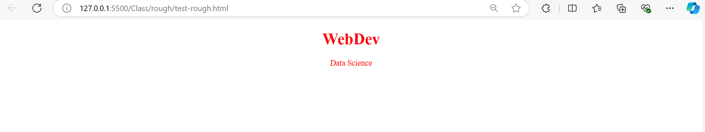
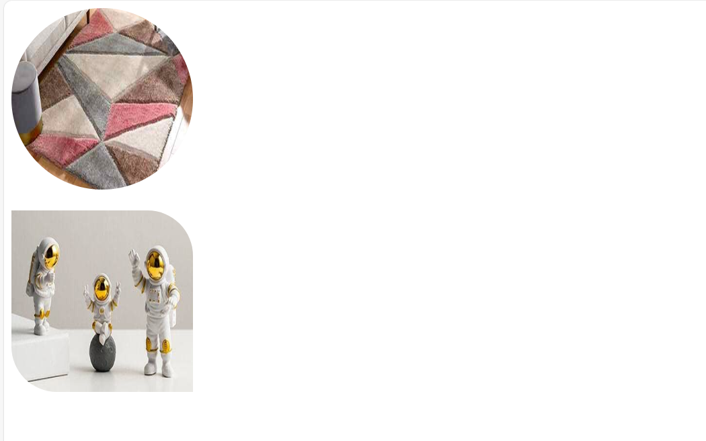

# CSS :-

<!-- Pending Notes -->

## Media type in CSS :-
It configures your styles for various device and viewport.

We can set style for screen, print and speech.

Syntax-
```
<style type="text/CSS" media="all|screen|speech|print">
</style>
```
- screen - to see effect on screen
- print - to see effect when we take printout

## Styles in external file :-
- We can write a styles in seperate stylesheet.
- Stylesheet have extension of ".css".
- Stylesheet can cascade over HTML pages. [Cascade Style Sheet].
- You can access across pages.
- However if you are using external files, then number of requests will increase for a page, whichinternally increases the page load time.

Syntax:-

1. Maintain seperate CSS file in folder called "styles" in "src" folder.
2. Add a new file called "name.css"
3. Link to webpage using-
`<link rel="stylesheet" href="src/styles/name.css">`

### Minification:-
- Minification is the process of compressing CSS.
- It is always recommended to Minify and use the CSS for production. [Live]
- CSS original file will occupy more space, we have to use them for development but not for production.

### Note :-
Priority order -

Inline > Embed > External 

=> If new properties are defined in external, embed, inline all will be applied.

```
<!DOCTYPE html>
<html lang="en">
<head>
    <meta charset="UTF-8">
    <meta name="viewport" content="width=device-width, initial-scale=1.0">
    <title>Document</title>
    <style>
        h1{
            color: blue;
            text-align: center;
        }
    </style>
    <link rel="stylesheet" href="../rough/src/styles/styles/css/test-rough.css">
</head>
<body>
    <h1 style="color: red; background-color: black;">Web Development</h1>
</body>
</html>
```


## Selectors :-
It refers to process of selecting an element in a web page. 


### Classification -
- Primary Selector
- Rational Selector
- Dynamic Pseudo Classes
- Structural Pseudo Classes
- Structural Pseudo Classes
- Element Pseudo Classes
- Validation State Pseudo Classes
- Attribute Selector
- Universal Selector
- Root Selector
- Behavioural Selector

#### Primary Selector :-
1. id selector
2. type selector
3. class selector

##### Type Selector -
Syntax-
```
<style type="text/css>
h1{
    color: red;
}
</style>
```
#### id selector -
=> id refers to identifying an element with unique names.
Syntax-
```
<style type="text/css>
#id_name{
    color: red;
}
</style>
```
<h5>Note :</h5>
-> In real time coding normally we write multiple designs(styles with effects). To use this design on multiple elements if we go for id selector then the effects would not be applied on the elments. To resolve this problem we go for class selector.

Example -
```
<!DOCTYPE html>
<html lang="en">
<head>
    <meta charset="UTF-8">
    <meta name="viewport" content="width=device-width, initial-scale=1.0">
    <title>Document</title>
    <style>
        #abc{
            color: red;
        }
        #def{
            color: green;
        }
        #styling{
            color: orangered;
        }
    </style>
</head>
<body>
    <h1 id="abc def">WebDev</h1>
    <h1 id="styling">Data Science</h1>
</body>
</html>
```
Output -


#### class selector -
If we want to apply multiple effects for an element then we go for class selector.

Syntax -
```
<style type="text/css>
.class_name{
    color: red;
}
.class2_name{
    effect: value;
}
</style>
```
FAQ :-
1. If styles are defined for any element in all 3 ways, then which set of effect would apply ?

=> 

2. If style container is defined with same attributes in both head and body section, then which set of effect would apply ?

=>

3. If the style container is defined with same attribute multiple times in body, then which set will apply ?

=>

4.  If styles are defined for any element in all 3 primary selector, then which set of effect would apply ?

=> Priority order -- id > class > type <br> if different effects are present the all would be applied.

5. If same attribute are defined using IDselector in embeded and external file, which set will apply ?


- Note --
```
<head>
    <style>
    ......
    ......
    </style>

    <link rel="...." src="......">

</head>
```
=> Line by line iterpretation happens[browser's memory].

6. It is possible to group the selector to apply the same effects on different elements ?
```
<!DOCTYPE html>
<html lang="en">
<head>
    <meta charset="UTF-8">
    <meta name="viewport" content="width=device-width, initial-scale=1.0">
    <title>Document</title>
    <style>
        #styling, .abc{
            color: red;
            text-align: center;
        }
        
    </style>
</head>
<body>
    <h1 class="abc">WebDev</h1>
    <p id="styling">Data Science</p>
</body>
</html>
```

Output -


#### Rational Selector -
- We can select elements using parent and child hierarchy.
- We can also select elements using siblings.

|selector|effect|
|-------|--------|
|parent child| all child elements in specific parent|
|parent>child| only direct child elements in specific parent|
|ElementA + ElementB| Adjacent selector[sibling]|
|ElementA ~ ElementB| Generic sibling|

#### Attribute Selector -
Syntax -
```
element_name[attribute]{
    effects
}

element_name[attributename=value]{

}
```

|Condition| Purpose|
|---------|--------|
[attribute="val"]| Equal specifies that it should be exact match
[attribute="val"]| It refers the value starting with specified
[attribute="val"]| It specifies the value ending with given term
[attribute="val"]| Name start with specified term and seperated with "-"
[attribute="val"]| Name starts with specified term and not binded with other words
[attribute="val"]| It matches the term at any location

<!-- Examples Pending -->

#### Dynamic Pseudo class selector

- Dynamic indicates that the effect can change according to state and situation.
- Pseudo means false representation
- Class refers to program template in computer programming, it contains predefined logci and data which you can implement and customize according to the requirements.

|Selector | Description |
|--|--|
|:link| Specifies effect for hyperlink [anchor in default state]|
|:visited | It defines effects for visited links [anchor in visited state]|
|:target | It defines effects for the target element [ used normally in intradocument (not scrollable)]   [Element is target of specified hyperlink]|
|:hover | It defines effects when mouse pointer is over element. [ mouseover] |
|:active | It defines effects when link is in active state [ mousedown ]|

> NOTE: Class can transform element apperance, transformatin time can be controlled by using "CSS Attribute called transition."


#### Validation state pseudo classes
- On that particular element we are validating

|Selector | Description |
|--|--|
|:valid | It defines effects for element if is value is valid against the validation defined<br>Validation can be verified by using : <br>minlength, maxlength, required, pattern, email , url, etc.|
|:invalid | It defines effect for element when it is invalid|
|:required| It defines effects to element when it verified with required |
|:optional | If it is not defines with required validation then it is treated as optional|

#### Element state selector

|Selector | Description |
|--|--|
|:enabled | It defines effects when element is enabled|
|:disabled| It defines effects when element is disable|
|:read-only | It defines effects when element is set to read-only|
|:checked| It defines effects when element is checked|
|:focus| It defines effects when element get focus|

#### Structural pseudo selector

- You can target your effects based on the position of the element in parent and child hierarchy 

|Selector | Description |
|--|--|
|:first-child| It defines effect only for first child element|
|:last-child| It defines effects only for last child element|
|:nth-child(LevelNumber)| It defines effects only to specific child element that occurs at given level.<br>1.Level number starts with<br>2. Index number starts with 0.<br>You can also define the pre-set value like "even & odd" to apply effects based on even and odd occurences|
|nth-of-type(3|3n|3n+1)| Select elemens from top nth occurrence |
|nth-last-of-type(3n+1)| Select elemetns from bottom nth occurence |

Ex.:
<p align=center>
    
</p>

CSS Code : 

```
<style>
    ol li:first-child {    /* first item of list*/
        color : red;
    }
    ol li:last-child {   /* last item of list*/
        color: green;
    }

    ol li:nth-child(even) {  /* those items which are in even position */
        font-size: 30px;
    }
</style>
```

``` 
<p align=center>
    
</p>
```

#### Behavioural and occurence class

<p>
    
    <i></i>
</p>

#### Universal selector :- 
is mainly used for applyi ng effects to all the element.

Syntax :
```
*{
    attribute=value;
}
```

#### Root Selector :-


#### Language Selector :-
It is used to give the effects based on a language configured for an element.

If your page contains multiple language data then to define the effects based on specific language we dgo for language selector.

Syntax :
```
elementName:lang(language to be chosen){
    attribute:value;
}
```
<!-- Code Pending -->

```
<!DOCTYPE html>
<html lang="en">
<head>
    <meta charset="UTF-8">
    <meta name="viewport" content="width=device-width, initial-scale=1.0">
    <title>Document</title>
    <style>
        p:lang(en){
            color: red;
        }
        p:lang(hindi){
            color: blue;
        }
        p:lang(fr){
            color: green;
        }
        
    </style>
</head>
<body>
    <p lang="en">Hello World!</p>
    <p lang="hindi">हैलो वर्ल्ड!</p>
    <p lang="fr">Bonjour le monde!</p>
</body>
</html>
```

Output --


Note :-
- All the properties of the parent will not reach to child. If we want it to reach to child then we use inherit value on particularv attribute or all attribute.

- After inheriting the attribute from parent ifthe child is interested in changing the value, then child can change the value or set the value to (default appearance).

- To remove the default nature of a particular element we use "unset" value to the attribute.

### CSS Box modek attribute -
1. margin
2. padding
3. border
4. border-radius
5. width


#### Margin:-
- It specifies the space around border
- You define by using following properties

1. margin[short hand sets in all direction]
2. margin-top
3. margin-bottom
4. margin-left
5. margin-right

Syntax :
```
{
    margin: 0px 0px 0px 0px; 
    
}
```
#### Padding :-
- It specifies space around content
- you can define
1. padding-left
2. padding-right
3. padding-top
4. padding-bottom
5. padding

#### Border :-
border : shoer hand for style, color and width. `<width>` `<style>` `<color>`

border-style : dotted, double, solid, dashed etc.

border-width : border size

border-color : border color

border-left : short hand for style color and width

border-left-style :

border-left-width :

border-left-color :

Similarly for all direction[indicates top, right, bottom]


#### CSS Border Radius :-
border-radius : short hand for all direction(top-left, top-right, bottom-right, bottom-left)

border-top-right-radius

border-top-left-radius

border-bottom-right-radius

border-bottom-left-radius

Note :-

In order to make image to appear like a proper circle width height value of a image should be made equal to border-radius value.
```
<!DOCTYPE html>
<html lang="en">
<head>
    <meta charset="UTF-8">
    <meta name="viewport" content="width=device-width, initial-scale=1.0">
    <title>Document</title>
    <style>
        #men{
            border-radius: 200px;
        }
        img{
            border-top-right-radius: 50px;
            border-bottom-left-radius: 50px;
        }
    </style>
</head>
<body>
    <br><br>
    
</body>
</html>
```

Output:


#### CSS Border Image:-
We can set image as border by using attributes like- <br> border <br> border-image

Syntax:
```
{

}
```

#### CSS Units :-
- Units defines size and position.
- They are used to define dimension and location of element in page.
- You can configure size with: height and width.
- The CSS units are categorized into 2 groups.
    1. Absolute length units
    2. Relative length units

##### Absolute Legth Units -
- They are not relative to anything else and are generally considered as normal units.
- These are nor affected by other relative  elemenyts and their units.
- They are not affected by parent or adjacent elments, they are individual and configured for various media devices.

|Unit|Name|Equivalent to|
|----|-----|-----------|
|cm| Centimeters | 1cm = 96px/2.54 = 37px|
|mm | Millimeters| 1mm = 1/10th of 1cm|
|Q| QuarterMillimeters| 1Q = 1/40th of 1cm|
|in| Inches | 1in = 2.54cm = 96px|

###### Usage of absolute path -
Note :-
When we are creating an animations on a button click, if we want to zoom then go for "Absolute Path"

If we want to move the objects little far in a screen then go for "inch|cm|mm"

Example-1) Relative Unit :
- These are related to other contents in the page
- The size of any element can be determined based on its parent, child or adjacent
- The advantages are when parent element size is changed it will relatively effect child elemnt too

|Unit| Rlative to|
|-----|---------|
|em| It uses the font size of parent element and applies to current element.[element relative] <br> Note: 1em -> 100% of parent element <br> 0.5em -> 50% of parent element|
|rem|Font size to the root element sizee[root element relative]|
|%| Relative to viewport|

When we use rem we need to target the root element(HTMl).


##### Relative Position -
- It is defined for parent element
- The parent element keeps all child elements relative to the context
- It requires placement of child element using absolute
- Fixed will keep element regard to page

#### Working with CSS Display options -
values of display are-
1. none
2. block
3. inline
4. inline-block
5. flex -> for responsive design
6. grid -> for responsive design

FAQ : WHat is the difference between `display:none` vs `visibility:hidden` ?

=> visibility:hidden will not remove the memory for that element on the page whereas display:none will remove the memory for that element on a page as a result of which it disturbs the layout of a page.

```
<!DOCTYPE html>
<html lang="en">
<head>
    <meta charset="UTF-8">
    <meta name="viewport" content="width=device-width, initial-scale=1.0">
    <title>Document</title>
    <style>
       body{
        height: 400px;
        width: 300px;
        margin: 10px;
        padding: 15px;
       }
    </style>
</head>
<body>
    <h1 style="display: none;">Display Option</h1>
    <!-- <br><br> -->
    
</body>
</html>
```


```
<!DOCTYPE html>
<html lang="en">
<head>
    <meta charset="UTF-8">
    <meta name="viewport" content="width=device-width, initial-scale=1.0">
    <title>Document</title>
    <style>
       body{
        height: 400px;
        width: 300px;
        margin: 10px;
        padding: 15px;
       }
    </style>
</head>
<body>
    <h1 style="visibility: hidden;">Display Option</h1>
    <!-- <br><br> -->
    
</body>
</html>
```


display:block -- Content will appear in new line.(`<br>`)

display:inline -- Content will appear in the same line.

display:inline-block -- To adjust the dimension of few HTML elements we use inline-block. Example- `<span> `, `<a>`....

display:flex -- should be applied on a container not on an element. 
1. By default the elements present inside a container would be arranged row-wise. 
2. If we apply display:flex on element we get abnormal behaviour as the response.
3. flex would support adjusting the elements in both row and column wise.
4. display:inline is applicable only for elements not for container.
```
<!DOCTYPE html>
<html lang="en">
<head>
    <meta charset="UTF-8">
    <meta name="viewport" content="width=device-width, initial-scale=1.0">
    <title>Document</title>
    <style>
       body{
        height: 400px;
        width: 300px;
        margin: 10px;
        padding: 15px;
       }
       span{
        height: 10px;
        width: 10px;
        background-color: orangered;
        color: white;
        border-radius: 50%;
        padding: 3px;
       }
       li{
           height: 20px;
           width: 400px;
           background-color: black;
           color: white;
           margin: 10px;
           padding: 10px;

           display: flex;
           flex-direction: row-reverse;
           justify-content: space-between;
       }
    </style>
</head>
<body>
    <ol>
        <li>HTML <span>1</span></li>
        <li>CSS <span>2</span></li>
        <li>JS <span>3</span></li>
    </ol>
</body>
</html>
```


5. 
 ```
display:flex;
flex-direction:column;
```
The elements present in the container would be adjusted as per the width of the container.
If the flex-deirection is row then the the elemnts present in the container would be adjusted as per the height of the container.

Example-1: 
```
<style>
        nav{
            height: 400px;
            border: 2px solid black;
            margin: 15px;
            padding: 10px;
            display: flex;
            flex-direction: column;

            justify-content: space-around;
            align-items: end;
        }

</style>


<body>
    <nav>
        <button>Home</button>
        <button>About</button>
        <button>Caontact</button>
        <button>Help</button>
        <button>Terms</button>
    </nav>
</body>
```


Example-2:
```
<style>
        nav{
            height: 400px;
            border: 2px solid black;
            margin: 15px;
            padding: 10px;
            display: flex;
            flex-direction: row;

            justify-content: space-around;
            align-items: end;
        }

</style>


<body>
    <nav>
        <button>Home</button>
        <button>About</button>
        <button>Caontact</button>
        <button>Help</button>
        <button>Terms</button>
    </nav>
</body>
```


Note : 
- In order to wrap the elemnts within the container we go for flex-wrap.
- If we set the container to wrap the elements would span to multiple rows depending upon width  of the elements.
- Example:
```
.container{
    display:flex;
    flex-wrap:wrap;
}
```
Elements will be adjusted in container by shifting to multiple rows as per screen adjustment(It will bnot shrink the content).

### CSS Background :
1. background-color
2. background-image
3. background-size
4. background-attachment
5. background-repeat

Note :
1. background-color    : rgb
2. background-image    : url("")
3. background-repeat    : no-repeat, repeat-x, repeat-y, repeat
4. background-attachment    : fixed, scroll
5. background-position    : left, right, center | top center bottom
6. background(shorthand property) : color image repeat position

Syntax:
    
    background: #ffffff url("img_tree.png") no-repeat right top;

FAQ => 
1. Can we set multiple background images ?

    Yes , It is possible but we need to control the alignment.
```
body{
            height: 100vh;
            background-image: url(../rough/public/images/menFashion.jpeg), url(../rough/public/images/womenFashion.jpeg);
            background-repeat: no-repeat, repeat;
            background-size: 30% 20%, 30% 50%;
            background-position: center center, top right;
     }
```

2. Can we change background image dynamically ?
    
    Yes, 


### CSS Font Effects :-
- font-family
- font-style
- font-weight
- font-variant : small-caps [all lower case letters convert into capital letters and font size is small].

### CSS Text Effects :
- text-align : left | center | right | justify
- text-shadow : (same like shadow box)
- text-indent : First line of the paragraph with some space(length | initial | inherit)
- text-transform : uppercase, lowercase, capitalize
- text-overflow : It can display overflowing text with chars like ellipsis
- text-decoration : overline, underline, linethrough, size, color.

#### While working with paragraph :-
line-height : space between lines
word-space : space between words
letter-space : space between chars
word-break : breaks lengthy words at right margin of paragraph
white-space : it controls wrapping of text in the container(nowrap)
overflow : hidden | scroll | auto

#### Shorthand for text decoration :-
text-decoration : text-decoration-line text-decoration-style text-decoration-color thickness

```
<style>
        p{
            border: 1px solid black;
            width: 200px;
            white-space: nowrap;
            text-overflow: ellipsis;
            overflow: hidden;
        }
    </style>
```


### Media Query :-
It is associated with making a page as responsive.
- Media have type : screen | print | speech
- Media have orientation : landscape | portrait
- Media have min-width and max-width
- min-width : It defines the value starting from specified units to end. eg- min-width: 600px (starting from 600px to end) <br> @media(width<=....px)
- max-width : It defines the value starting from 0px to specified units. eg- max-width: 400px (starting from 0px to 400px) <br> @media(width>=....px)

Note : CSS Animations, CSS 2D, CSS 3D --

